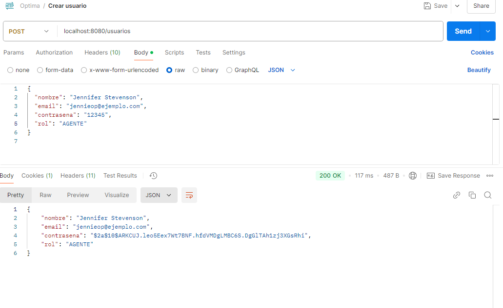
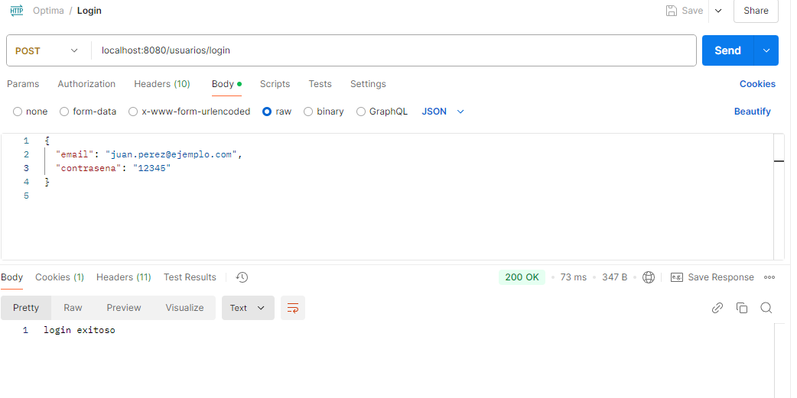
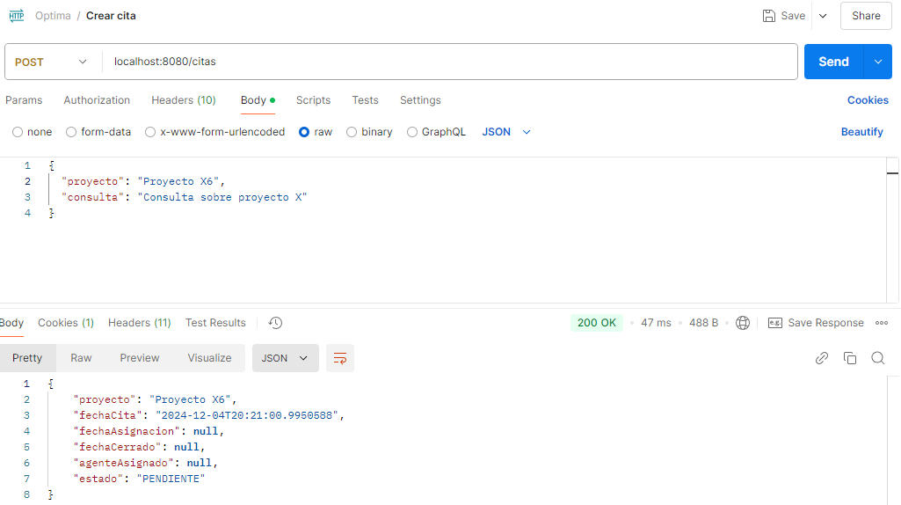
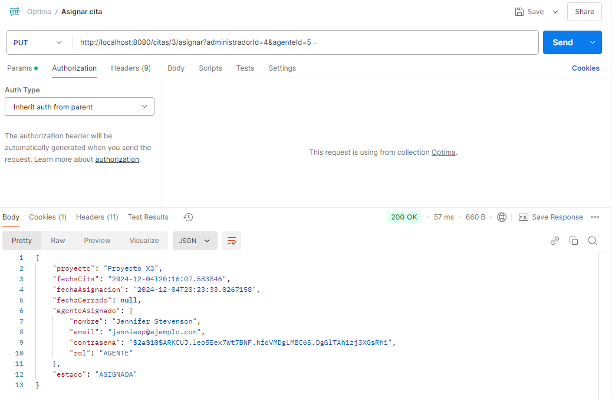
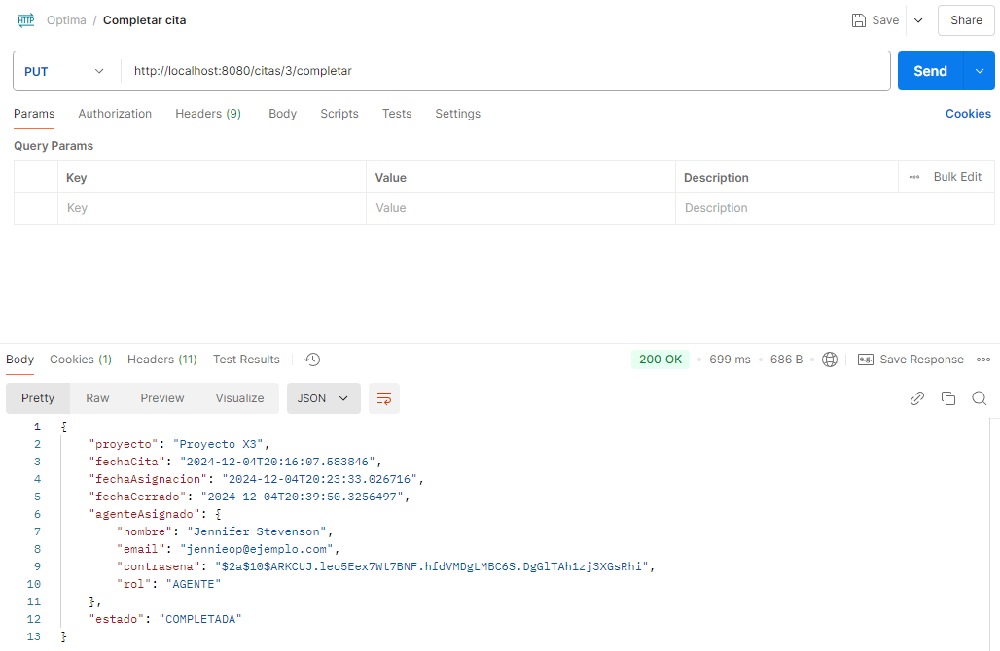
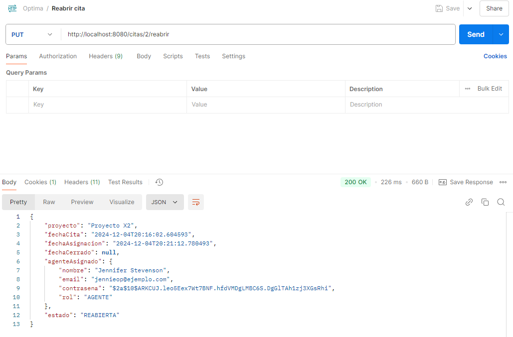
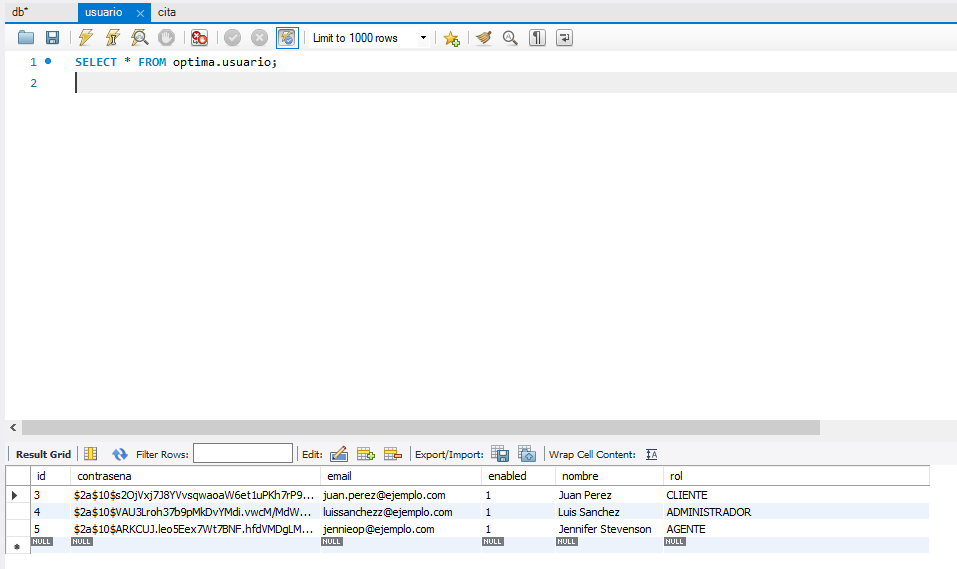
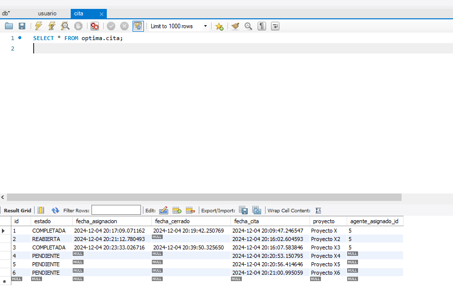

# Proyecto en SpringBoot para Sistema de citas de proyectos
1. Crear usuario en Postman

2. Login en Postman

3. Crear cita en Postman

4. Asignar cita en Postman

5. Completar cita en Postman

6. Reabrir cita en Postman

7. Tabla usuario en la base de datos MySQL

8. Tabla cita en la base de datos MySQL

# Instrucciones para la ejecución del API

1. Primero modifica la información de la base de datos local en el archivo application.properties en la ruta "Proyecto/src/main/java/resources. Edita las siguientes variables:
    spring.datasource.url=jdbc:mysql://localhost:3306/optima
  spring.datasource.username=root
  spring.datasource.password=1234

3. Ejecuta el comando "mvn clean package" en una terminal dentro de la carpeta Proyecto

4. Luego entra a la carpeta Target y ejecuta en una terminal el comando "java -jar OptimaTest-0.0.1-SNAPSHOT.jar
